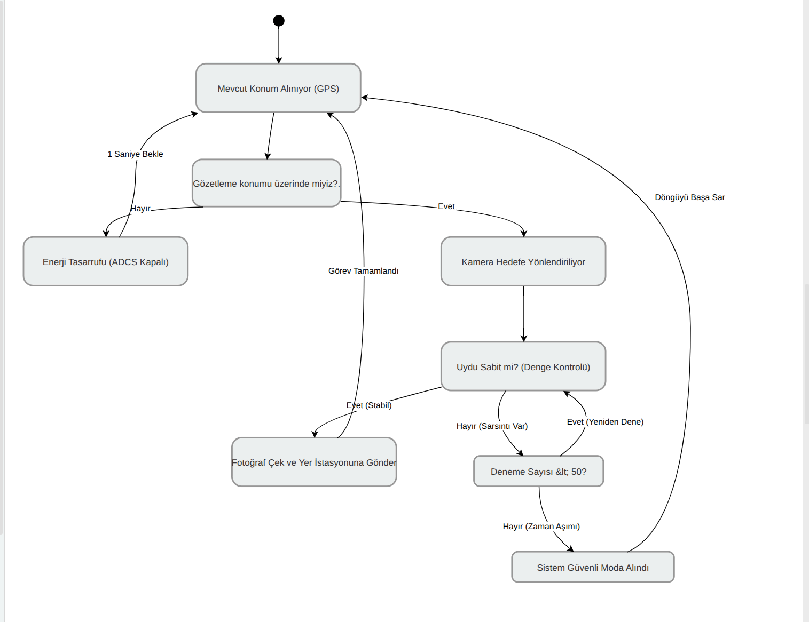

# ULUBEY_ASTRO - CubeSat OBC Mission Software

ULUBEY_ASTRO, Astro Hackathon yarışması için geliştirilen bir yeryüzü gözlem uydusunun (CubeSat) OBC (On-Board Computer) üzerinde çalışacak görev yazılımıdır.

Bu repo, görev karar mantığının ve donanım arayüzlerinin ayrık katmanlarda yönetildiği, FreeRTOS tabanlı bir gömülü yazılım mimarisi sunar.

## Proje Özet

Projenin temel hedefi:
- Uydunun Dünyada hedef bölgeler için (örnek: Bursa enlem aralığı) kontrolleri yapmak
- ADCS modunu dinamik olarak yönetmek (Idle / Targeting)
- Stabilizasyon sonrası payload adımlarını tetiklemek (kamera + radyo)
- Hata/timeout durumlarında sistemi kilitlemeden güvenli şekilde döngüye devam etmek

Temel kod katmanları:
- Interfaces katmanı: Donanım soyutlama arayüzü
- Logic katmanı: Görev karar algoritması
- Core/FreeRTOS katmanı: Task oluşturma, scheduler entegrasyonu

## Neden FreeRTOS?

Bu proje birden fazla zaman-kritik adımı kontrollü şekilde yönetmek için FreeRTOS kullanır.

FreeRTOS kullanma nedenleri:
- Deterministik görev zamanlaması
- Görevlerin birbirinden ayrık ve okunabilir şekilde tasarlanması
- Gecikme/yoklama davranışlarının güvenli ve standart API ile yönetilmesi (`osDelay`)
- Uçuş yazılımı olgunlaştıkça event/queue/semaphore gibi mekanizmalara geçiş kolaylığı

Ek olarak bu projede:
- `configTICK_RATE_HZ = 1000` olduğu için 1 tick yaklaşık 1 ms'dir
- Mission task periyodik döngü mantığı ile çalışır

## Dizin Yapısı

Ana klasörler:
- `ULUBEY_ASTRO/Core`: STM32 ve FreeRTOS entegrasyonu
- `ULUBEY_ASTRO/Interfaces`: Donanımdan bağımsız arayüz fonksiyonları
- `ULUBEY_ASTRO/Logic`: Görev algoritması (mission manager)
- `ULUBEY_ASTRO/EWARM`: IAR EWARM proje dosyaları
- `docs`: Teknik raporlar, akış diyagramları

## Mission Algoritması

Ana algoritma `ULUBEY_ASTRO/Logic/mission_manager.c` içindedir.

Akış:
1. GPS verisini al
2. Hedef enlem aralığında ise ADCS'i targeting moda al
3. ADCS stabil olana kadar polling yap (`200 ms` adım)
4. `50` deneme sonunda stabil değilse timeout hata logu bas, idle moda dön, döngü başına git
5. Stabil olduğunda payload adımlarını tetikle:
	- Kamera capture
	- Radyo transmit
6. Her mission döngüsünün sonunda `1 saniye` bekle

Timeout güvenliği:
- `50 x 200 ms ~= 10 saniye`
- Amaç: sonsuz bekleme nedeniyle sistem kilitlenmesini engellemek

## Algoritma Diyagramı

Aşağıdaki diyagram mission algoritmasının genel akışını gösterir:

Diyagram açıklaması:
- Giriş noktası konum okuma adımıdır
- Hedef bölge kontrolü iki kola ayrılır (target / idle)
- Target kolunda ADCS stabilizasyon bekleme döngüsü bulunur
- Timeout kolu hata yönetimi ve fail-safe dönüşü temsil eder
- Stabil durumda payload eylemleri ardarda çalıştırılır
- Sistem periyodik olarak döngüye geri döner

## Dokümanlar

Ek dokümanlar:
- `docs/teknik_rapor_mission_logic.md`: Mission logic teknik raporu

## Notlar

- Interface katmanı şu an placeholder uygulamalar içerir.
- Gerçek uçuş/saha kullanımı için GPS, ADCS, kamera ve radyo sürücüleri gerçek donanımla bağlanmalıdır.
- `printf` loglarının UART'a aktarımı hedefe göre retarget implementasyonu gerektirebilir.
